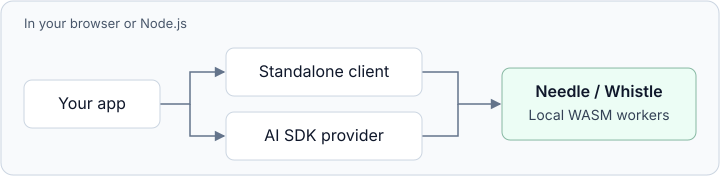

# cactus-needle

Local tool calling, structured extraction, embeddings, and speech transcription
for JavaScript and TypeScript, powered by [Needle](https://github.com/cactus-compute/needle)
and [Whistle](https://www.cactuscompute.com/blog/whistle).

Both models run in Node.js and browsers, on the CPU in WebAssembly workers.
Use the standalone API or the optional [Vercel AI SDK](https://ai-sdk.dev/) provider.
Inference needs no API key, server, or GPU.



## Install

```sh
npm install cactus-needle
```

## Environments

Choose imports for your environment. Text and speech are available in both.

| Environment | Standalone | AI SDK provider |
| --- | --- | --- |
| Node.js 22.18+ | `cactus-needle` | `cactus-needle/ai-sdk` |
| Browser | `cactus-needle/browser` | `cactus-needle/ai-sdk/browser` |

Browsers require HTTPS or localhost, WebAssembly, and module workers. Vite
handles the packaged worker and WASM assets; see [browser setup](docs/usage.md#browser-loading)
for other bundlers.

## Capabilities

| Capability | Model | Standalone methods |
| --- | --- | --- |
| Tool calling | Needle | `complete()`, `generate()`, `run()` |
| [Structured extraction](docs/usage.md#extraction) | Needle | `extract()` |
| [Text embeddings](docs/usage.md#sessions) | Needle | `embed()` |
| [Speech transcription](docs/usage.md#speech) | Whistle | `transcribe()` |
| [Live transcription](docs/usage.md#live-transcription) | Whistle | `stream()` |
| [Audio encoder features](docs/usage.md#speech) | Whistle | `embed()` |

The standalone examples below use Node.js imports. For browsers, import the
same names from `cactus-needle/browser`; the methods are the same.

### Tool calling

Define the actions your application supports. Needle selects tools and fills
their arguments from the user's request. It is intended for tools and structured
data, not general chat.

```js
import { Needle, tool } from 'cactus-needle';

const needle = new Needle({
  tools: {
    set_lights: tool({
      description: 'Turn the lights in a room on or off.',
      inputSchema: {
        type: 'object',
        properties: { room: { type: 'string' }, on: { type: 'boolean' } },
        required: ['room', 'on'],
      },
    }),
  },
});

try {
  const result = await needle.complete('Turn on the kitchen lights');
  console.log(result.function_calls);
  // [{ name: 'set_lights', arguments: { room: 'kitchen', on: true } }]
} finally {
  await needle.close();
}
```

`complete()` and `generate()` return predictions. To execute them and feed results
back to the model, add an `execute` callback to each tool and call
[`needle.run(text)`](docs/usage.md#running-tools).

### Speech to text

```js
import * as needle from 'cactus-needle';

try {
  console.log((await needle.transcribe('clip.wav')).text);
} finally {
  await needle.close();
}
```

Like Python's `needle.transcribe()`, this helper loads and reuses Whistle.
It accepts uncompressed WAV or PCM samples, up to 30 seconds per call.
In Node.js, a string names a local file; in a browser, it names an audio URL.
Browsers also accept a `File` from a file input. Decode MP3, WebM, and other
compressed formats to PCM first.

Use `new Whistle()` to manage your own speech session. See the
[speech guide](docs/usage.md#speech) for live transcription, supported languages,
word timestamps, and audio features.

## Model loading

Standalone constructors and shared helpers load on first use. Needle's default
weights are 35.3 MB; Whistle's are 16.9 MB. Only the model you use is loaded.
Missing default weights download from Hugging Face and are cached on disk in
Node.js, or in browser storage when available.

Keep an instance while your application needs it, then call `close()`. Changing
tools on that instance keeps the model loaded. Top-level `transcribe()`, `stream()`,
and `extract()` share default models; top-level `close()` releases them.

For custom weights, offline use, and the eager `createNeedle()` / `createWhistle()`
factories, see [Node.js loading](docs/usage.md#nodejs-loading) or
[browser loading](docs/usage.md#browser-loading).

## Vercel AI SDK

An optional integration for the same local models. Supports AI SDK 6
and 7. Standalone users do not need `ai`.

Install the SDK and, for this example, Zod:

```sh
npm install ai zod
```

In Node.js, provision weights before using the provider:

```ts
import { generateText } from 'ai';
import { downloadModel } from 'cactus-needle';
import { createNeedle } from 'cactus-needle/ai-sdk';
import { z } from 'zod';

const modelPath = await downloadModel();
const needle = createNeedle({ modelPath });

const { toolCalls } = await generateText({
  model: needle('needle3'),
  tools: {
    set_lights: {
      description: 'Turn the lights in a room on or off.',
      inputSchema: z.object({ room: z.string(), on: z.boolean() }),
    },
  },
  prompt: 'Turn on the kitchen lights',
});

console.log(toolCalls);
```

In browsers, import `createNeedle` from `cactus-needle/ai-sdk/browser` and use
`createNeedle()`; default weights download and cache on first use. The provider
creates and closes a worker for each SDK request.

The adapter supports tool calling, structured output, text embeddings, and batch
transcription through `needle.transcriptionModel('whistle')`. It accepts one user
turn plus optional system messages; text streaming is buffered. Use the standalone
API for tool loops and live audio. See the [AI SDK guide](docs/ai-sdk.md) for examples.

## Documentation

- [Standalone API](docs/usage.md)
- [AI SDK guide](docs/ai-sdk.md)
- [Development](docs/development.md)

## License

Apache-2.0. An independent wrapper for Cactus Compute's Needle and Whistle. See
[LICENSE](LICENSE), [NOTICE](NOTICE), and the [upstream license](vendor/LICENSE).
